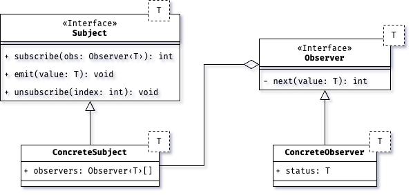

# Reactive Programming and RxJs
Commonest programs focuses on manage data in synchronous way, however, our daily life is based on event managing, that is, react to external events that does not depends from us and that can't be handled once by time. In fact, **Reactive Programming** is a programming paradigm focuses on data streams that flows asynchronously in our program, and that are known as events. Just like Agile Methodology, Reactive Programming is based on the [**Reactive Manifesto**](.https://www.reactivemanifesto.org/), which defines Reactive Systems as software systems based on the following principles:

* **Responsive**, that is, the Software System must react in time to external events like limit values or errors. Moreover, an higher Responsiveness means a better User Experience, since the system can easily react immediately to errors or limit values.
* **Resilient** systems stays responsive in face of failure. Making a system resilient means that failure must be isolated and do not compromise the whole.  
* **Elastic**, under different workloads, an elastic system must remain responsive. Different workload means distribute the resources in an efficient way between all the application's components.
* **Message Driven**. Reactive Systems are based on asynchronous messaging between different elements, moreover, dispatch events and failures using messaging is an efficient way to use the same construct for different event's communication.

Why do we need to apply Reactive Programming to normal programs? Starting from the basis, let's consider the following scenario: you have to make an http request to the server, involving updating users' data, let's suppose that this is done by a function and then, once the server answer with a successful response, you have to update the UI using another function. The resulting code will be something like this:

```javascript
const response = updateUserData(userData);
updateUI(response);
```

what is the problem of this code? Well, it is executed **synchronously**, that is, the user must wait the termination of the previous functions before continuing in its tasks. Of course, this is not a suitable scenario for most applications, and due to the JavaScript's single-thread nature, we do not have any built in constructor that helps us in create an asynchronous piece of code.

Luckily, JavaScript provides **callbacks** functions, to handle long-running operations. We can pass a callback functions as parameters that will be executed once the operation is completed. From a theoretical point of view, the callbacks implements the **inversion of control**, meaning that the execution's flow is passed to the function once it is invoked and then returned to the application's main flow.

However, callbacks are not a suitable solution for error handling and conditional operations, since require nesting the code like this:

```javascript
updateUserData(userData, (response) => {
      if (response.status === 200) {
            updateUI(response, () => {
                  showMessage('Success!');
            });
      } else {
            updateUI(response, () => {
                  showMessage('Error');
            });
      }
});
```

moreover, callback share the same application's state, that is any changes to the application's internal state could have a **side effect** on each element in the application itself. Of course, we would like to minimize the use of side-effect functions using only **pure** functions. Luckily, starting from **ES6**, JavaScript introduces **Promise**. A Promise is a data type that wraps asynchronous code using two callbacks to handle operation's success and failure scenarios, that is our code can be written in a better and cleaner way:

```javascript
updateUserData(userData)
      .then((result) => updateUI(result))
      .then((result) => showMessage(result))
      .catch((error) => showMessage(error));
```

now our code seems prettier right? However, there are some things that can be improved, in fact, promise's error's does not allows us to handle multiple errors. Moreover, <u>we cannot stop the execution of a promise once it has been triggered</u>, which is a serious lack in HTTP calls that require extra resources.

Therefore, we need a new paradigm to handle asynchronous code, focusing on pure functions and whose execution sequence can be defined by the programmer like in synchronous code. **Reactive Programming** can help us, because it focuses on merging asynchronous executions using **Functional Programming** elements, allowing us to deal code like a data flow where pure functions are used to define each step of the flow.

## RxJs Library

RxJs is the acronyms for **Reactive Extension for JavaScript**, is a useful library based on functional and reactive programming paradigm, focusing on threating data as an unique flow to be consumed, known as **Stream**. Moreover, RxJs uses well known patterns like **Observer** and **Iterator**.

The first and most important step is switching our mindset from the classic imperative approach to the reactive one, let's consider the following example:

```javascript
let a = 1;
let b = 2;
let c = a + b; // c = 3
a = 2;
```

what is the value inside the variable `c` after the assignment `a = 2`? Of course is `3`, nothing special right? However, in the reactive approach is will be `4`, let's see in the following example:

```javascript
let a$ = [1];
let b$ = [2];
let $c = a$.merge(b$).reduce((curr, next) => curr + next, 0);
```

`a$`, `b$` and `c$` are no more simple variables now are streams, moreover `c$` is the stream created by merging `a$` and `b$` whose value is the result of the sum of all the merged streams. Therefore, since streams are any data flow, any update to the `a$` or `b$` are reflected to the `c$` stream, thus if we change `a$` to the value `[2]`, `c$` will contain the value `[4]`. Notice that in the reactive programming, any stream is indicated using the `$` symbol for convention.

### Architectural Concepts

RxJs works on **Stream** that is the <u>data flowing process between the source who emits data and who is observing the emitted values</u>, between these two entities there is a **Pipeline**, that is a set of operators performed between the emission of the data and the observation of them. Respect to Promise, a stream is a **Lazy Data Flow**, thus it will start to emit values only if someone has been registered and is observing them, on the other hand, a Promise starts to emit values as soon as is triggered in the normal program's execution flow.

Moreover, a stream does not depends on the program's execution flow, that is, it can be triggered many times in the future and will stop its execution only when no one is observing.

In the following figure, we can see the representation of a stream and its components:

<p align="center">
    
</p>

- The **Observable** is the source of the data that emit values and whose can be observed, technically, it is known also as **Producer**.

- The values emitted by the observable flows in a **Pipe** where some **Operators** can be used to transform data before reaching their final destination. There is no limit on the number of operators that can be add in a pipe, moreover, the operators are pure functions as in Functional Programming.

- Last, the entity who is observing values emitted by the observable is the **Observer**, known as the **Consumer**.

As you can see, the data can flow starting only from the Producer and reaching the Consumer as final destination, it is not possible to create an alternative flow. Moreover, as you can see, once a Consumer is attached looking for values emitted by a Producer, the values can be emitted in time independently by the program's main flow.

## Observer Design Pattern

RxJs and Reactive Programming are based on the [`Observer Design Pattern`](https://en.wikipedia.org/wiki/Observer_pattern#:~:text=In%20software%20design%20and%20engineering,calling%20one%20of%20their%20methods.), in this section we are going to examine this Design Pattern and we will show an example of it in the [`index.ts`](./index.ts) file.

Sometimes we have to define a sort of dependency between our project's entities, moreover we would like to notify to each of these entities any updates that occur in another one. From a software perspective, we would like to have high levels of **cohesion** and low levels of **coupling**. That is, low level of coupling means that any changes in an entity must not affect any other, and high level of cohesion means that an entity must focus on a single purpose.

Consider the following scenario: there is a set of devices connected to a temperature sensor, any new device can be connected to the sensor without additional effort, and any status change of the temperature must be notified from the sensor to each connected device. Observer describes how this scenario can be implemented, creating the relationships between the emitter of the events (that is the temperature sensor) and the listeners (the devices). Sometimes you probably heard about this interaction as **publish-subscribe**.

Let's see now how the pattern is concretely implemented:

<p align="center">
    
</p>

there are two main entities in that UML diagram, the **Subject** and the **Observer**, the former is the source of events that a Observer can listen and change its internal state. The Subject contains a list of subscribed Observer to inform them when new values are going to be emitted. The **ConcreteSubject** is the actual Subject that emits events, and contains a list of Observer to which notify the updates. Finally, the **ConcreteObserver** is the real Observer containing an internal state.

That is, the pattern can be useful in the following scenarios:

- When we would like to have a relationship between objects without knowing the exact number of entities involved.
- When updates must be notified in a broadcast manner to each object connected to a specific one.

moreover, there are pros and cons in using this pattern:

- There is a **weak relationship** between Subjects and Observers, that is, an Observer from another level of part of the project, can listen for changes emitted by the Subject in another part. There is no need to change the code if there is no more the relationship between the Observer and the Subject.

- Changes from the Subject and emitted to each Observer using **broadcast communication** without the Subject knows who is listening for them.

- However, without knowing who is listening for changes, some updates can cause errors and having an excessive cost for some of the Observers.

Now, we will show an example of this pattern in a real example. Notice that we are going to use names that are used in RxJs to describe how these elements works in the library. Let's consider the previous example of the sensor and the devices, starting from creating the interfaces Observer and Subject, however, we would like to trace the subscription of the Observer in the Subject using an uuid created each time in the Observer. The abstract classes that we will use as Subject and Observer are the following:

```typescript
abstract class Subject<T> {
      private readonly observers: Array<Observer<T>>;

      public constructor() {
            this.observers = new Array<Observer<T>>();
      }

      public abstract subscribe(observer: Observer<T>): void;
      public abstract emit(value: T): void;
      public abstract close(): void;
}

abstract class Observer<T> {
      private readonly uuid: string;

      public constructor() {
            this.uuid = uuidv4();
      }

      public abstract next(value: T): void;
      public abstract closed(): void;
}
```

now, we are going the create the concrete classes that simulate the Sensor and the Devices. The sensor must implement the Subject class, and will emit strings representing the numeric value of the temperature. Each time a new value is detected from the Sensor, is notified to each registered Observer. However, if someone is disconnecting the Sensor from the network (invoking the `close` method), the new status will be notified to each attached Device, and then a variable will be used to avoid emission of new temperature's values.

```typescript
class Sensor extends Subject<string> {
      public constructor() {
            super();
      }

      public override subscribe(observer: Observer<string>): void {
            this.observers.push(observer);
      }
      public override emit(value: string): void {
            if (!this.isClosed) {
                  this.observers.forEach((observer) => observer.next(value));
            }
      }

      public override close(): void {
            if (!this.isClosed) {
                  this.observers.forEach((observer) => observer.closed());
                  this.isClosed = true;
            }
      }
}
```

let's consider now the two ConcreteObservable represented by the classes `IOSDevice` and `AndroidDevice` both extending the class `Observable`. Each device implements its version of the `next` method, and each one has a different internal state that is represented by the values emitted from the Sensor, and having some statistical measurements of the temperatures emitted from the Subject:

```typescript
class AndroidDevice extends Observer<string> {
      private readonly temperatures: Array<string>;

      public constructor() {
            super();
            this.temperatures = [];
      }

      public get mean() {
            return this.temperatures
                  .map((temperature) => parseInt(temperature) / this.temperatures.length)
                  .reduce((acc, temperature) => acc + temperature, 0);
      }

      public override next(value: string): void {
            this.temperatures.push(value);
            console.log(`[AndroidDevice] - temperature ${value}`);
      }

      public override closed(): void {
            console.log('The sensor is disconnected!');
      }
}

class IOSDevice extends Observer<string> {
      private readonly temperatures: Array<string>;

      public constructor() {
            super();
            this.temperatures = [];
      }

      public get min() {
            return this.temperatures
                  .sort((aTemperature, bTemperature) => parseInt(aTemperature) - parseInt(bTemperature))
                  .at(0);
      }

      public get max() {
            return this.temperatures
                  .sort((aTemperature, bTemperature) => parseInt(bTemperature) - parseInt(aTemperature))
                  .at(0);
      }

      public override next(value: string): void {
            this.temperatures.push(value);
            console.log(`[IOS] - temperature ${value}`);
      }

      public override closed(): void {
            console.log('The sensor is disconnected!');
      }
}
```

Therefore, as you will see from the complete example shown in [`index.ts`](./index.ts), after that a ConcreteObserver is subscripted to the Subject, the `next` function will be triggered and after that the Sensor has been disconnected, each Device will not listen for additional values, even if some values will be emitted from the Sensor later.

## Marble Diagrams
Learning Reactive Programming is hardly, thus, to help us in learning and switching from Imperative to Reactive Paradigm we can use the **Marble Diagrams**, that are a visual representation of a Stream and the application of Operators to events emitted by the Producer to the Consumer. There are few symbols between a Marble Diagram that we will see in this chapter. Let's start considering the following scenario: a Producer is emitting a set of numbers before terminating, meanwhile an operator is between the Producer and the Consumer, and transforms value in it successor, this situation can be represented by the following Marble Diagram:

<p align="center">
    
</p>

the Marble diagram that represents the previous scenario can be written as follows: the upper arrow represents our stream, where each circle containing a number is an event emitted during all the Stream's lifecycle, at the end of the arrow there is a vertical bar, that is the point where the Stream's life is terminated. The lower arrow is the input stream after the application of the operator between them.

In the following case we have just one operator that maps each number in its successor, notice that the operator is no more than an high order function accepting as parameter another function having as parameter a single number `x` and returning another number `x + 1`. Moreover, there is no limit in the number of operators that can be applied to a stream, however, you have to take into account that each operator produces a result, and this result will be the input of the next operator in the chain.

As we can see, Marble Diagrams are an easy solution to an hard concept to understand like Reactive Programming, in the next chapter we will use a lot of Marble Diagrams to explain each operator and theoretical concept that we will encounter.
